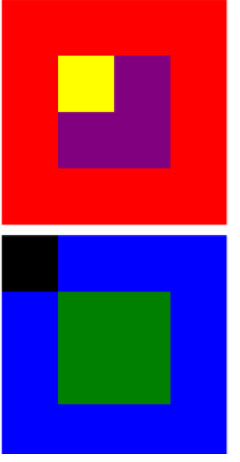

# FREELANCER

1. APELLIDOS Y NOMBRES:

    -Joñoruco Morales Nefeli

2. OBJETIVO

El reto consiste en replicar el siguiente ejercicio

3. DESCRIPCION: -Este proyecto es importante ya que nos ayudara a practicar
 las diferentes posiciones que se puede utilizar

4. HERRAMIENTAS:

  -HTML5 Y CSS3
